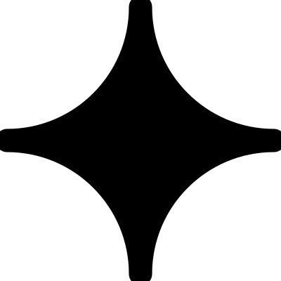

# lyrava — brand asset pack

**Version 02 · "the sparkle" · May 2026**

A four-point luminous sparkle in cream-and-gold on deep aubergine. Fifteen SVG files cover every surface from a 16×16 favicon to a 1200×630 Open Graph card. All assets share one geometry — a sparkle drawn as four cubic-arc arms rotated about the centre — and one fixed gradient. The asset set is intentionally small. If a surface needs something not in this pack, the pack is wrong, not the surface.

---

## Contents

```
lyrava-brand-assets/
├── README.md
│
├── lyrava-mark-glow.svg            — hero mark · 1200 × 1200
├── lyrava-mark-dark.svg            — sparkle on aubergine · 400 × 400
├── lyrava-mark-light.svg           — sparkle on paper · 400 × 400
├── lyrava-mark-mono.svg            — sparkle only, currentColor · 400 × 400
│
├── lyrava-wordmark-light.svg       — light surface · 720 × 200
├── lyrava-wordmark-dark.svg        — dark surface · 720 × 200
├── lyrava-wordmark-mono.svg        — currentColor · 720 × 200
│
├── lyrava-lockup-horizontal.svg    — mark + wordmark, side-by-side · 880 × 220
├── lyrava-lockup-stacked.svg       — mark above wordmark · 480 × 560
│
├── lyrava-favicon.svg              — browser favicon · 64 × 64
├── lyrava-apple-touch.svg          — iOS home screen · 180 × 180
├── lyrava-icon-192.svg             — PWA · 192 × 192
├── lyrava-icon-512.svg             — PWA · 512 × 512
│
├── lyrava-og.svg                   — Open Graph card · 1200 × 630
└── lyrava-twitter.svg              — Twitter / X card · 1200 × 600
```

---

## File-by-file

### Marks

#### `lyrava-mark-glow.svg` · 1200 × 1200
The hero rendering. Three-pass Gaussian halo (σ = 6 / 22 / 72) under a crisp top copy of the sparkle. The card is a radial gradient `#221440 → #190C2E → #0C0620`. The sparkle core is a radial gradient `#FFFFFF → #FFFBF1 → #F8E4B2 → #F5D38A`. Use for launch screens, app tiles, large hero placements, end-cards.

- **Min size:** 96 px digital / 24 mm print
- **Card radius:** 13.3% of edge
- **Tip extent:** 0.95r
- **Waist ratio:** 0.087r

#### `lyrava-mark-dark.svg` · 400 × 400
Standalone solid sparkle on aubergine card. No glow filter — uses the same Lumen→Halo gradient on the same Nocturne card, just smaller and crisper. Use for avatars, app icons at intermediate sizes, dark-surface badges.

- **Card radius:** 14% of edge
- **Min size:** 32 px

#### `lyrava-mark-light.svg` · 400 × 400
Inverse — aubergine sparkle (`#1A0E2C`) on warm cream paper card. For light-surface badges, business cards, light-mode UI badges.

#### `lyrava-mark-mono.svg` · 400 × 400
Just the sparkle, no card, transparent background, fill set to `currentColor`. Use inside body copy, inline with text, or in any context where the surrounding text colour should flow through.

```html
<span style="color: #1A0E2C">
  
</span>
```

---

### Wordmarks

All wordmarks are **Outfit 600** at 130 px, letter-spacing `-5.2` (−4% tracking), with the sparkle sized to roughly match the cap-height of a lowercase letter and positioned where the full stop would sit.

#### `lyrava-wordmark-light.svg` · 720 × 200
Aubergine wordmark for light surfaces. Used in header chrome, footers on Paper, letterheads, invoices.

#### `lyrava-wordmark-dark.svg` · 720 × 200
Cream wordmark for dark surfaces. The terminal sparkle uses the Lumen→Halo gradient so it stays consistent with the hero mark.

#### `lyrava-wordmark-mono.svg` · 720 × 200
Single-colour wordmark with `fill: currentColor`. Both the text and the sparkle inherit. Use anywhere you need the wordmark to take on a parent colour — print on coloured stock, embossing, etching.

---

### Lockups

#### `lyrava-lockup-horizontal.svg` · 880 × 220
Mark card on the left, wordmark on the right. The standard "logo" when both elements need to read at once — letterheads, presentation title slides, email footers, invoice headers.

#### `lyrava-lockup-stacked.svg` · 480 × 560
Mark above, wordmark centred below. Use for portrait surfaces: end-cards on social, login screens, the spine of a deck, vertical banner ads.

---

### Icons

All icons are rounded-square cards with the sparkle centred. The card radius is tuned per file to feel consistent across iOS, Android, and browser favicon grids.

| File | Use | Card radius | Min display |
|------|-----|-------------|-------------|
| `lyrava-favicon.svg` | Browser tab, bookmarks | 14 / 64 | 16 px |
| `lyrava-apple-touch.svg` | iOS home screen | 40 / 180 | 60 px |
| `lyrava-icon-192.svg` | PWA standard | 42 / 192 | 96 px |
| `lyrava-icon-512.svg` | PWA hero, splash | 112 / 512 (with halo bloom) | 192 px |

For `apple-touch` and `icon-512`, a soft radial halo (`#FFE9B8 → transparent`) sits behind the sparkle. The `favicon` and `icon-192` omit it for pixel clarity at small sizes.

---

### Social

#### `lyrava-og.svg` · 1200 × 630
Open Graph card. Glow-treated sparkle on the left, two-line headline and meta strip on the right.

> *Data, automation and engineering*
> *for teams that want to move faster.*
>
> UK · DELIVERY FROM INDIA

When the destination platform requires a PNG, render this SVG at 2× (2400 × 1260) and export to PNG.

#### `lyrava-twitter.svg` · 1200 × 600
Centred glow-treated sparkle with the wordmark below. Tighter, more iconic — for tweet cards, link previews, link-in-bio.

---

## Tokens

These are the only colours that may appear in any branded surface. Halo and Lumen live inside the mark; they do not become UI accents.

| Role | Hex | Notes |
|------|-----|-------|
| **Nocturne** | `#1A0E2C` | Primary dark surface; the mark's aubergine card |
| **Nocturne deep** | `#0E0820` | Vignette edge of the card gradient |
| **Nocturne lift** | `#221440` | Centre of the card gradient |
| **Lumen** | `#FFFFFF` | Sparkle core highlight |
| **Halo soft** | `#FFF1C9` | Mid-stop of the core gradient |
| **Halo** | `#F5D38A` | Outer-stop, warm cream-gold |
| **Paper** | `#F5EFE3` | Warm cream, light surfaces |
| **Smoke** | `#EFE8D8` | Secondary light surfaces, cards |
| **Ink** | `#0E0E10` | Body text on light |
| **Ink soft** | `#5F5E5A` | Secondary text on light |

CSS custom properties:

```css
:root {
  --nocturne: #1A0E2C;
  --nocturne-deep: #0E0820;
  --nocturne-lift: #221440;
  --lumen: #FFFFFF;
  --halo-soft: #FFF1C9;
  --halo: #F5D38A;
  --paper: #F5EFE3;
  --smoke: #EFE8D8;
  --ink: #0E0E10;
  --ink-soft: #5F5E5A;
}
```

---

## Geometry

The sparkle is one arm rotated four times about the origin. One arm:

```
M -16.5 -190                              ← tip cap, top
A 16.5 16.5 0 0 1 16.5 -190               ← rounded tip
A 173.5 173.5 0 0 0 190 -16.5             ← concave arc to next waist
A 16.5 16.5 0 0 1 190 16.5
…rotate 90°…
…rotate 180°…
…rotate 270°…
Z
```

**Scaling rule.** At any radius `r`:

- Waist offset = `0.087 · r`
- Tip extent = `0.95 · r`
- Inner concave-arc radius = `0.913 · r`
- Tip cap radius = waist offset

Always recompute, never freehand. The four-fold symmetry only resolves if the path is generated from these ratios.

---

## Type

| Family | Weight | Use |
|--------|--------|-----|
| **Outfit** | 600 | Wordmark, display headings |
| **Inter** | 400 / 500 | Body, UI |
| **JetBrains Mono** | 400 / 500 | Captions, kickers, technical metadata, code |

- Wordmark tracking: `-4%` (or `letter-spacing: -0.04em`)
- Never use weights ≥ 700. Heaviness reads as cheap.
- Sentence case for headings. ALL CAPS only for 11 px monospace eyebrow labels.

---

## Rules

**R1 — Lowercase. Always.**
Never `Lyrava`. Never `LYRAVA`. The wordmark is set as `lyrava` — that's the entire grammar.

**R2 — The sparkle is the dot.**
It terminates the wordmark and sizes to roughly the cap-height of a lowercase letter. Do not enlarge it. Do not move it inside the word.

**R3 — Clear-space.**
Reserve a margin equal to the cap-height of `l` on every side of the wordmark, and an equal margin around any mark card. Nothing crosses into the clear-space.

**R4 — Symmetry is the law.**
Never rotate. Never reflect. The four-fold symmetry only resolves at 0°.

**R5 — Don't recolour the gradient.**
The Lumen → Halo soft → Halo stop set is fixed. The sparkle does not turn green for spring or red for Christmas. The card may not become teal because the page is teal.

**R6 — One glow, never two.**
If the surface already has bloom or atmosphere, use a flat mark (`mark-dark` / `mark-light`). If the mark glows, keep the surface quiet.

**R7 — Minimum size.**
Mark: 24 px digital / 8 mm print. Below that, use the favicon (solid sparkle, no glow filter).

**R8 — Never on imagery.**
The wordmark sits on Paper or Nocturne. Photography is not a brand surface. Exception: the mark card (glow or dark) may sit on a dark, quiet photograph if the sparkle still reads cleanly.

---

## Embedding

### Web — header lockup

```html
<link rel="icon" type="image/svg+xml" href="/assets/lyrava-favicon.svg">
<link rel="apple-touch-icon" href="/assets/lyrava-apple-touch.svg">

<a href="/" aria-label="lyrava — home">
  
</a>
```

### Web — Open Graph

```html
<meta property="og:image" content="https://lyrava.com/assets/lyrava-og.svg">
<meta name="twitter:card" content="summary_large_image">
<meta name="twitter:image" content="https://lyrava.com/assets/lyrava-twitter.svg">
<meta name="theme-color" content="#1A0E2C">
```

### Print

Outline the type before exporting. The wordmark uses Outfit 600 at `-4%` tracking — if the press doesn't have Outfit, the file must be outlined, not substituted.

For embroidery, etching, and other one-colour processes, use `lyrava-mark-mono.svg` or `lyrava-wordmark-mono.svg` and set a single ink colour. Never approximate the gradient.

---

## Changelog

- **v02 · May 2026 — "the sparkle".** Mark introduced. Tokens redrawn to deep aubergine and cream-gold. Glow rendering becomes primary. Wordmark retains lowercase / `-4%` tracking, sparkle replaces the dot.
- **v01 · 2025 — wordmark-only.** Lowercase `lyrava.` on Paper / Ink. No mark.

---

## License

These assets are the property of Lyrava Ltd (UK, Registered in England & Wales). They are licensed for use only by Lyrava team members and partners producing materials on Lyrava's behalf. Redistribution or modification outside that scope requires written permission.
